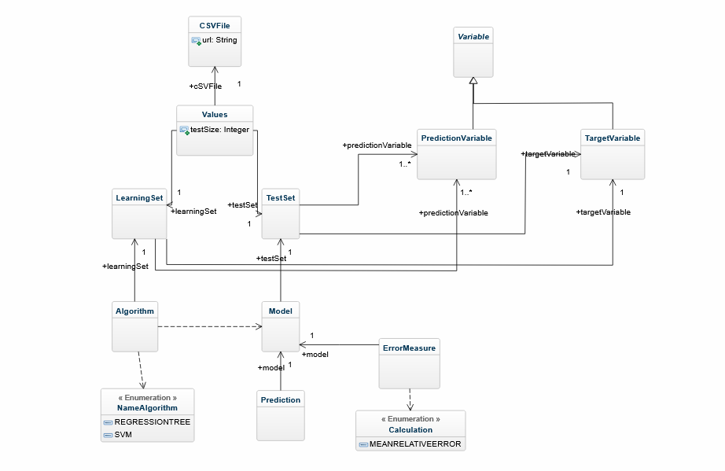

# IDM_GH - Emile Georget & Hélène Heinlé -M2 MIAGE - DLIS, 2020-2021

## Contexte du projet

Dans le but d'en apprendre plus sur les langages dédiées (ou Domain Specific Language, ou DSL) abordés en cours d'IDM, nous avons eu l'occasion d'en élaborer un.
Notre domaine d’étude était le Machine Learning Régression (ou ML Régression). La ML Régression consiste en un ensemble de méthodes d'apprentissage automatique 
qui permettent de prédire une variable continue (y) en fonction de la valeur d'une ou plusieurs variables prédictives (x).

### Syntaxe abstraite : le métamodèle de notre DSL

Avant de nous lancer dans la programmation du DSL, nous avons lister les concepts qui nous semblaient essentiels à la régression. Pour cela, nous nous sommes aidés
de cours de M1 MIAGE sur les prévisions et d'internet. Nous avons pu lister des concepts comme :
* variable cible
* variables prédictives
* ensemble d'apprentissage
* ensemble de test
* prédiction, vérité
* algorithme
* modèle de prédiction
* erreur de prédiction

Avec cette liste nous avons pu établir le métamodèle suivant qui nous a servi de base pour la construction de notre DSL.

### Syntaxe concrète : la grammaire de notre DSL

Nous avons souhaité réaliser un langage plutôt simple d'utilisation, qui permet à un utilisateur non initié de spécifier le contexte d'une régression.
Avec cette idée et le métamodèle précédent en tête, nous sommes arrivés à [cette grammaire](org.xtext.idmGH.mlregDsl/src/org/xtext/idmGH/mlregDsl/MLReg.xtext).
L'utilisateur peut, à l'aide de cette grammaire, écrire des fichiers avec l'extension ".mlr". Cette grammaire permet de spécifier les paramètres suivants :
* file: c'est le chemin vers le jeu de données en CSV. C'est le fichier qui contient les varaibles cible et prédictives.
* testSize: c'est la taille de l’ensemble de test en pourcentage. Elle représente le pourcentage du jeu de données sur lequel le modèle va être testé. 
Le reste du jeu de données sera l'ensemble qui permettra au modèle de prédiction d'apprendre. Pour ce paramètre, un nombre entier compris entre 0 et 99 doit être saisi. La taille conseillée est 30%).
* predictiveVariables: ce sont les indices des variables prédictives dans le jeu de données.
* targetVariable: c'est l'indice de la variable cible dans le jeu de données.
* algorithm: c'est l’algorithme à utiliser pour entraîner le modèle de prédiction. Les algorithmes acceptés par notre grammaire sont : RegressionTree, SVM ou Linear.
* errorType: l’erreur à calculer pour montrer la précision de la prédiction. Les types d'erreurs acceptées par notre grammaire sont : rmse (root mean squared error), mae (mean absolute error) ou r2 (r2 score).

Il existe une variation dans ces paramètres selon le compilateur (R ou Python) utilisé par la suite : Python reconnaîtra les indices des variables à partir de 0 contrairement
à R qui commence à 1. Pour y en indice 0 et x en indice 1, on aura, en entrée, la même configuration ".mlr" mais le modèle de prédiction se basera :
* en Python : sur la colonne 0 et la colonne 1
* en R : sur la colonne 1 et la colonne 2

## Utilisation du projet
Pour utiliser notre DSL, il faut :
* cloner ce projet git et le visualiser depuis Eclipse DSL
* compiler la [grammaire](org.xtext.idmGH.mlregDsl/src/org/xtext/idmGH/mlregDsl/MLReg.xtext)
* 

### Docker
Nous avons créer des images Docker pour avoir des environnements disposant des dépendances Python et R. Vous trouverez le Dockerfile R [ici](https://github.com/hheinle/IDM_GH/tree/master/org.xtext.idmGH.mlregDsl.tests/r_docker) et le Dockerfile Python [ici](https://github.com/hheinle/IDM_GH/tree/master/org.xtext.idmGH.mlregDsl.tests/python_docker).
Afin de pouvoir construire les images, il faut :
* avoir Docker sur votre machine
* avoir le plugin Docker tooling dans Eclipse IDE
Il est alors possible de construire les images depuis les Dockerfile et de lancer les conteneurs associés depuis Eclipse.
Nos Dockerfile permettent de lancer les fichiers ".r" ou ".py" obtenus depuis nos compilateurs.
